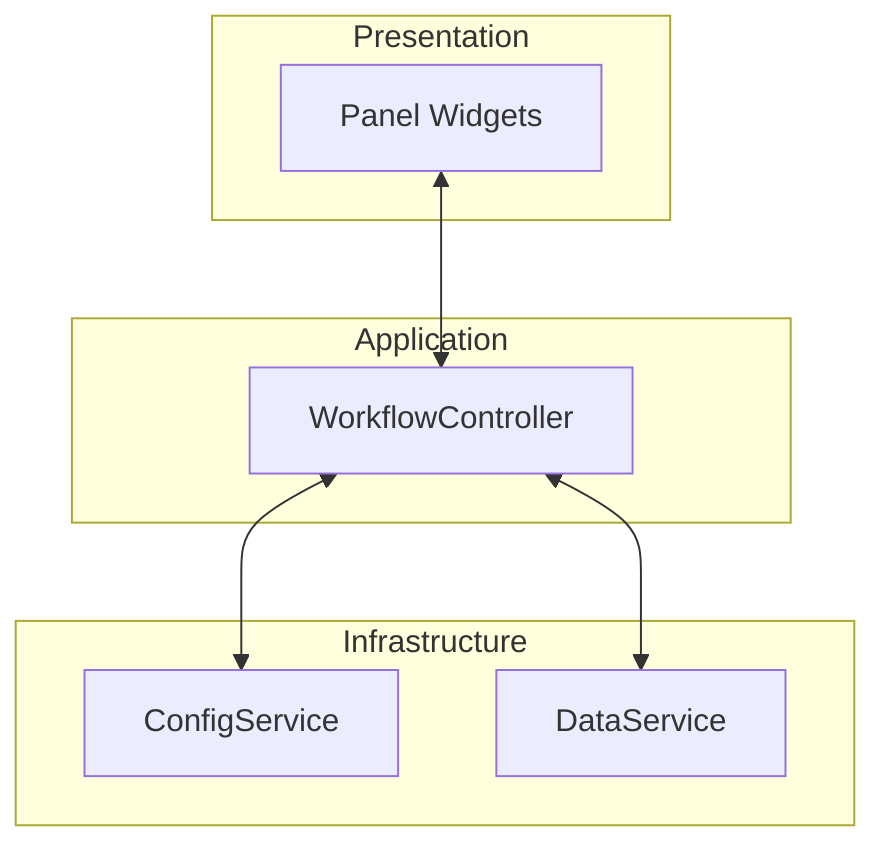
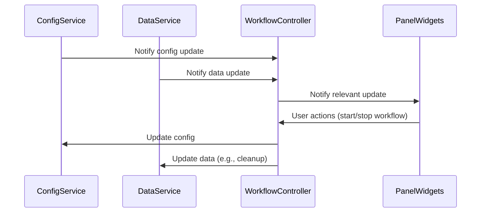
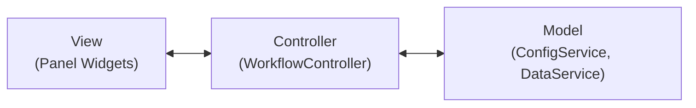

# Beamlime Dashboard Architecture Design Document

## Overview

This document describes the architecture of the Beamlime dashboard, focusing on the separation of concerns between configuration, data management, and presentation. It also analyzes the alignment of the implementation with the Model-View-Controller (MVC) pattern, including future plans for controller interaction with both configuration and data services.

---

## 1. Architecture Description

### 1.1. High-Level Structure

The Beamlime dashboard is architected with clear separation between infrastructure, application logic, and presentation. The main components are:

- **ConfigService**: Manages configuration state, schema validation, and message passing (e.g., via Kafka).
- **DataService**: Manages detector and reduction data, provides subscription mechanisms for data updates.
- **WorkflowController**: Orchestrates workflow operations, mediates between services, and exposes a clean API for the UI.
- **Panel Widgets**: Present data and controls to the user, interact only with the controller.

#### Mermaid Diagram: Component Overview

### 1.2. Subscription and Notification Flow

- **ConfigService** and **DataService** both provide subscription mechanisms for change notifications.
- **WorkflowController** subscribes to updates from these services and maintains local state as needed.
- **Panel Widgets** subscribe to the controller for updates, remaining decoupled from service details.

#### Mermaid Diagram: Subscription Flow

### 1.3. Future Interaction: Controller and DataService

- The controller will be responsible for coordinating actions that affect both configuration and data.
- Example: When a workflow is removed, the controller will update the configuration (via ConfigService) and remove associated data (via DataService).
- This centralizes business logic and keeps the UI and services decoupled.

---

## 2. MVC Pattern Description and Analysis

### 2.1. Mapping to MVC

| MVC Component | Beamlime Implementation |
|---------------|------------------------|
| Model         | ConfigService, DataService |
| View          | Panel Widgets              |
| Controller    | WorkflowController         |

- **Model**: Encapsulates state and provides subscription mechanisms.
- **View**: Presents data and controls, does not access model or service internals.
- **Controller**: Mediates between model and view, handles user actions, coordinates updates.

#### Mermaid Diagram: MVC Mapping

### 2.2. Analysis

#### Strengths

- **Clear Separation of Concerns**: Each layer has a well-defined responsibility.
- **Testability**: Controller and widgets can be tested in isolation using fakes for services.
- **Maintainability**: Business logic is centralized in the controller, reducing duplication and coupling.
- **Extensibility**: Future requirements (e.g., controller interacting with multiple services) are easily accommodated.

#### Potential Pitfalls

- **Controller Bloat**: As the controller mediates more services, it may accumulate too many responsibilities. Mitigate by delegating service-specific logic and splitting controllers if needed.
- **State Synchronization**: The controller must ensure its local state is always synchronized with the services. Always treat services as the source of truth.
- **Subscription Complexity**: Multiple layers of subscriptions can become hard to manage. Use clear naming and documentation for callbacks.

#### Anti-Patterns Avoided

- **No Leaky Abstractions**: Views do not know about service internals.
- **No Tight Coupling**: Controller is independent of Panel, allowing for easy testing and reuse.
- **No Direct Service Access from Views**: All business logic flows through the controller.

---

## 3. Summary

The Beamlime dashboard architecture is robust, maintainable, and well-aligned with the MVC pattern. The deliberate separation of controller logic from Panel ensures testability and flexibility. The design is future-proofed for additional coordination between configuration and data management, with clear boundaries between infrastructure, application logic, and presentation.

---