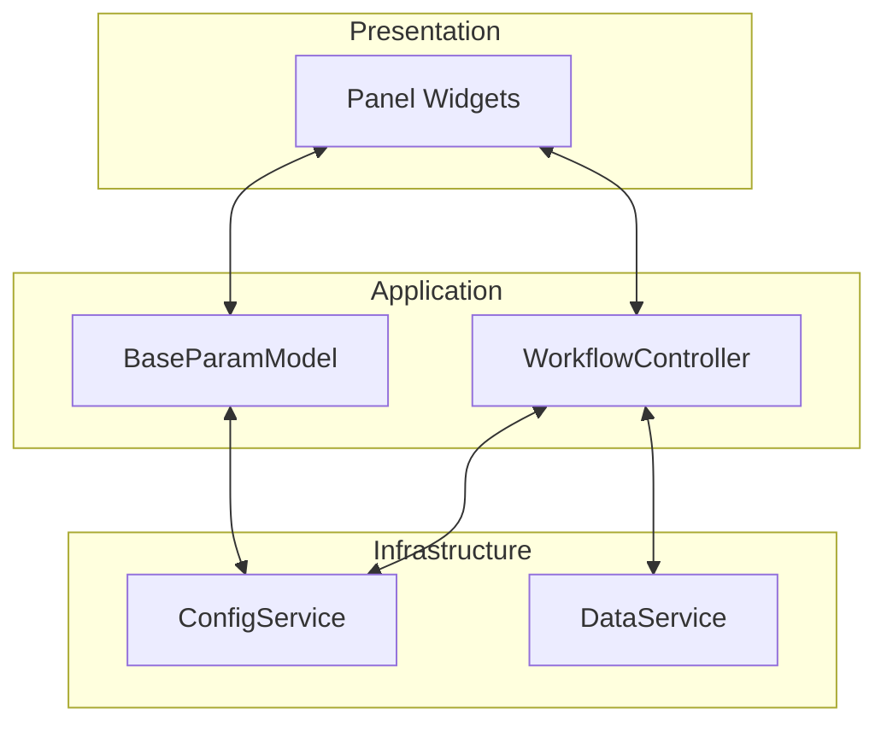
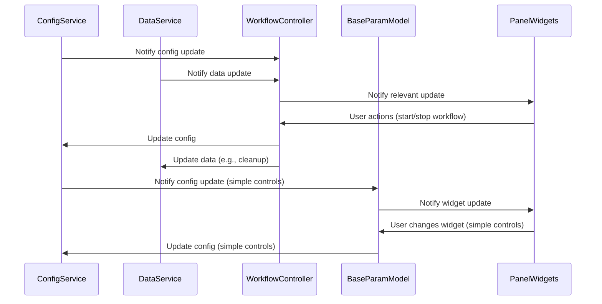
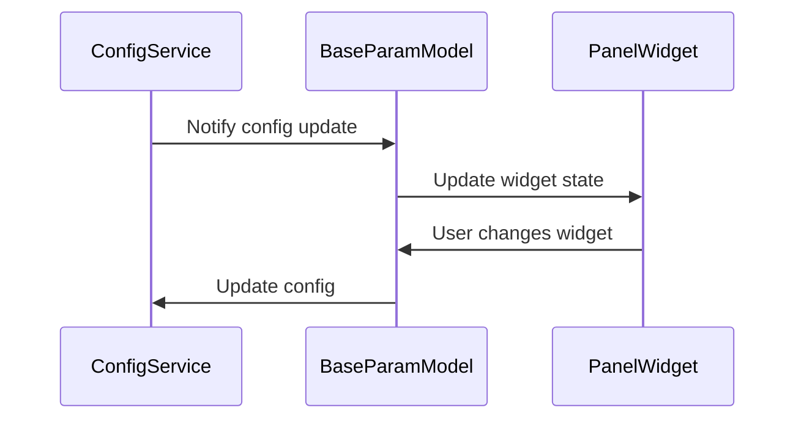
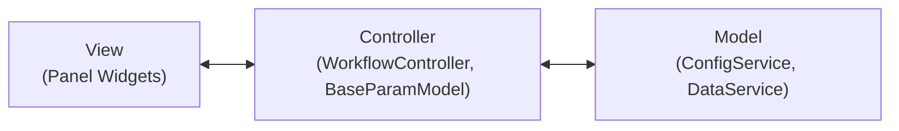

# Beamlime Dashboard Architecture Design Document

## Overview

This document describes the architecture of the Beamlime dashboard, focusing on the separation of concerns between configuration, data management, and presentation. It also analyzes the alignment of the implementation with the Model-View-Controller (MVC) pattern, including future plans for controller interaction with both configuration and data services.

---

## 1. Architecture Description

### 1.1. High-Level Structure

The Beamlime dashboard is architected with clear separation between infrastructure, application logic, and presentation. The main components are:

- **ConfigService**: Manages configuration state, schema validation, and message passing (e.g., via Kafka).
- **DataService**: Manages detector and reduction data, provides subscription mechanisms for data updates.
- **WorkflowController**: Orchestrates workflow operations, mediates between services, and exposes a clean API for the UI.
- **Panel Widgets**: Present data and controls to the user, interact only with the controller.
- **BaseParamModel**: Acts as a translation layer and per-widget controller for simple configuration widgets, bridging Param (GUI) and Pydantic (backend/config).

#### Mermaid Diagram: Component Overview

### 1.2. Subscription and Notification Flow

- **ConfigService** and **DataService** both provide subscription mechanisms for change notifications.
- **WorkflowController** subscribes to updates from these services and maintains local state as needed.
- **Panel Widgets** subscribe to the controller for updates, remaining decoupled from service details.
- **Panel Widgets** for simple configuration controls can also interact with **BaseParamModel**, which handles subscription and update propagation for its associated config key.

#### Mermaid Diagram: Subscription Flow

### 1.3. Future Interaction: Controller and DataService

- The controller will be responsible for coordinating actions that affect both configuration and data.
- Example: When a workflow is removed, the controller will update the configuration (via ConfigService) and remove associated data (via DataService).
- This centralizes business logic and keeps the UI and services decoupled.

---

## 2. The `BaseParamModel` Mechanism

### 2.1. Purpose and Role

`BaseParamModel` is a key architectural component for simple configuration widgets. It serves as a dedicated translation layer and per-widget controller, bridging the gap between:

- **Param models** (`param.Parameterized`): Used for GUI widgets and user interaction.
- **Pydantic models**: Used for backend validation, serialization, and communication.

This mechanism enables a clean, testable, and maintainable way to synchronize widget state with configuration state, without leaking infrastructure details into the presentation layer.

### 2.2. How It Works

- Each simple configuration widget is backed by a `BaseParamModel` subclass.
- The `BaseParamModel`:
  - Registers the relevant Pydantic schema with `ConfigService`.
  - Subscribes to config updates for its key, updating the widget state when changes arrive.
  - Propagates user changes from the widget to `ConfigService` by translating Param state to a Pydantic model.
- This pattern allows for direct, robust two-way binding between the GUI and configuration for simple controls, without requiring a centralized controller for each widget.

#### Mermaid Diagram: BaseParamModel Flow

### 2.3. Architectural Implications

- **Localized Coupling**: `BaseParamModel` knows about both Param and Pydantic models, but this coupling is intentional and limited to the translation layer.
- **No Architectural Problem**: This is not problematic coupling, but a necessary and well-encapsulated translation between two distinct model types.
- **Testability**: The translation logic is isolated and can be tested independently.
- **Extensibility**: More complex workflows or controls can use a centralized controller (`WorkflowController`), while simple controls benefit from this lightweight mechanism.

---

## 3. MVC Pattern Description and Analysis

### 3.1. Mapping to MVC

| MVC Component | Beamlime Implementation |
|---------------|------------------------|
| Model         | ConfigService, DataService |
| View          | Panel Widgets              |
| Controller    | WorkflowController, BaseParamModel (for simple controls) |

- **Model**: Encapsulates state and provides subscription mechanisms.
- **View**: Presents data and controls, does not access model or service internals.
- **Controller**: Mediates between model and view, handles user actions, coordinates updates.

#### Mermaid Diagram: MVC Mapping

### 3.2. Analysis

#### Strengths

- **Clear Separation of Concerns**: Each layer has a well-defined responsibility.
- **Testability**: Controller and widgets can be tested in isolation using fakes for services.
- **Maintainability**: Business logic is centralized in the controller, reducing duplication and coupling.
- **Extensibility**: Future requirements (e.g., controller interacting with multiple services) are easily accommodated.
- **Efficient for Simple Controls**: The `BaseParamModel` mechanism avoids unnecessary boilerplate for simple, stateless controls.

#### Potential Pitfalls

- **Controller Bloat**: As the controller mediates more services, it may accumulate too many responsibilities. Mitigate by delegating service-specific logic and splitting controllers if needed.
- **State Synchronization**: The controller must ensure its local state is always synchronized with the services. Always treat services as the source of truth.
- **Subscription Complexity**: Multiple layers of subscriptions can become hard to manage. Use clear naming and documentation for callbacks.

#### Anti-Patterns Avoided

- **No Leaky Abstractions**: Views do not know about service internals.
- **No Tight Coupling**: Controller is independent of Panel, allowing for easy testing and reuse.
- **No Direct Service Access from Views**: All business logic flows through the controller or a dedicated translation layer.

---

## 4. On the Coupling Between Param and Pydantic in `BaseParamModel`

### 4.1. Is This Coupling a Problem?

The direct coupling between `param.Parameterized` (Param models) and specific Pydantic models in `BaseParamModel` implementations is not an architectural problem. Instead, it is a necessary and intentional translation layer:

- **Purposeful Translation**: `BaseParamModel` is responsible for converting between the GUI’s editable state (Param) and the validated, serializable config object (Pydantic).
- **Localized Responsibility**: The coupling is limited to this translation layer, keeping the rest of the codebase agnostic to Param or Pydantic details.
- **Analogous to Adapters**: This is similar to a Data Transfer Object (DTO) assembler or adapter in other architectures.

### 4.2. Would a Canonical Controller Help?

- A more canonical, centralized controller would still need to perform this translation between GUI and backend models.
- Moving the logic to a controller would not remove the need for translation; it would only relocate it.
- Keeping the translation close to the widget, where the mapping is 1:1, is pragmatic and keeps the code simple.

### 4.3. Best Practice

- As long as the translation logic is well-encapsulated (as in `BaseParamModel`), this is not an anti-pattern.
- If more complex mappings or further decoupling are needed, the translation logic can be refactored into a separate adapter or service.
- For most cases, the current approach is idiomatic, robust, and maintainable.

---

## 5. Summary

The Beamlime dashboard architecture is robust, maintainable, and well-aligned with the MVC pattern. The deliberate separation of controller logic from Panel ensures testability and flexibility. The design is future-proofed for additional coordination between configuration and data management, with clear boundaries between infrastructure, application logic, and presentation.

The `BaseParamModel` mechanism provides an efficient, maintainable solution for simple configuration controls, acting as a per-widget controller and translation layer between Param and Pydantic models. This approach