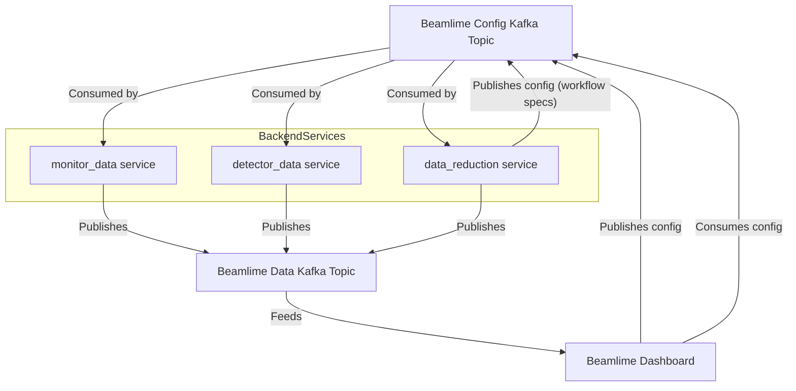
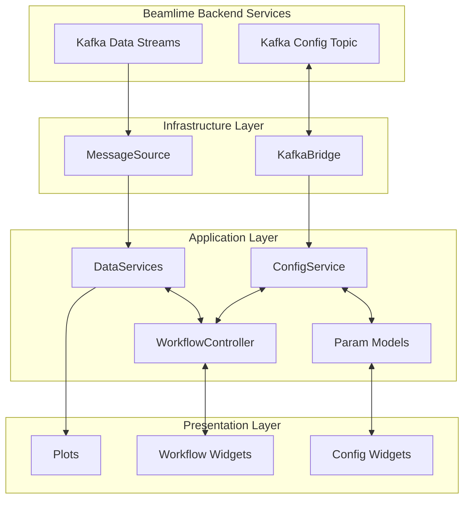
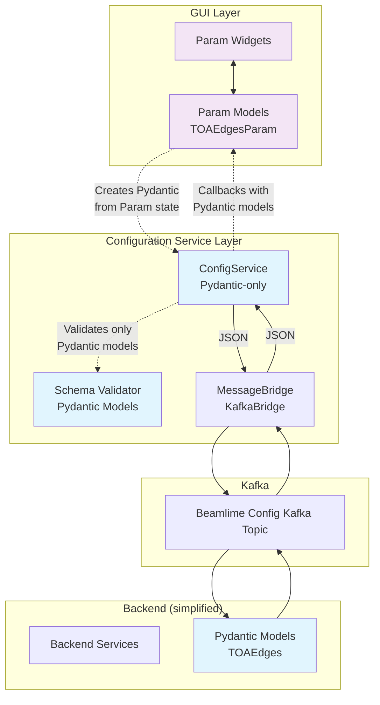

# Beamlime Dashboard Architecture

## Table of Contents

1. [Overview](#overview)
2. [System Context: Dashboard and Kafka Integration](#system-context-dashboard-and-kafka-integration)
3. [High-Level Architecture](#high-level-architecture)
4. [Configuration Architecture - Pydantic vs Param Separation](#configuration-architecture---pydantic-vs-param-separation)
5. [Data Flow Architecture](#data-flow-architecture)
6. [The BaseParamModel Mechanism](#the-baseparammodel-mechanism)
7. [Background Threading Architecture](#background-threading-architecture)
8. [Extension Points](#extension-points)

## Overview

The Beamlime dashboard is a real-time data visualization system that follows a layered architecture with clear separation of concerns between presentation, application logic, and infrastructure. The system is designed for live display of raw and processed detector data with configurable processing parameters, using dependency injection patterns for testability and maintainability.

A key architectural principle is the separation between **Pydantic models** (used for Kafka message validation and backend communication) and **Param models** (used for GUI widgets and user interaction).

The dashboard processes 1-D and 2-D data displayed using Holoviews with update rates on the order of 1Hz. Data updates are received via Kafka streams, and user controls result in configuration updates published to Kafka topics for backend consumption.

## System Context: Dashboard and Kafka Integration

The Beamlime dashboard operates within a Kafka-based system, interacting with multiple backend services via Kafka topics for both data and configuration.



**Key Points:**
- Backend Services publish data streams to a single Kafka topic
- The Dashboard consumes this data topic, feeding into internal `DataService` components
- The Dashboard both publishes to and consumes from the config topic
- All backend services consume the config topic for configuration updates
- The `data_reduction` service can publish configuration messages (workflow specs, status)

## High-Level Architecture



### Component Overview

The architecture is structured in three main layers:

- **Infrastructure Layer**: Manages Kafka integration and external message sources
- **Application Layer**: Contains business logic, orchestration, and data management
- **Presentation Layer**: Handles GUI components and user interaction

<!-- TODO: Verify if WorkflowController is implemented and how it interacts with existing components -->

## Configuration Architecture - Pydantic vs Param Separation

The dashboard implements a configuration system that maintains a clear separation between frontend widgets (using Param for interactive controls) and backend validation/communication (using Pydantic models throughout). The `ConfigService` operates entirely with Pydantic models, ensuring type safety and validation consistency.

### Configuration Flow Overview



### Key Architectural Design

The implementation enforces **Pydantic models throughout the ConfigService**:

1. **ConfigService Validation**: Only accepts `pydantic.BaseModel` instances via `update_config()`
2. **Schema Registration**: Requires `type[pydantic.BaseModel]` for schema registration
3. **Message Serialization**: Uses Pydantic's `model_dump(mode='json')` for Kafka messages
4. **Callback Data**: Subscribers receive validated Pydantic model instances

### Two-Way Configuration Flow


### BaseParamModel Translation Mechanism

The `BaseParamModel` serves as a **translation layer** that:

1. **Outbound (Param → Pydantic)**: Creates Pydantic models from Param state using `self.schema.model_validate(kwargs)`
2. **Inbound (Pydantic → Param)**: Extracts data from Pydantic models using `model.model_dump()`
3. **Schema Binding**: Connects each Param model to its corresponding Pydantic schema
4. **Validation**: Ensures all data flowing through ConfigService is properly validated

```python
# BaseParamModel's key methods
def from_pydantic(self) -> Callable[..., None]:
    def update_callback(model: pydantic.BaseModel) -> None:
        self.param.update(**model.model_dump())  # Pydantic → Param
    return update_callback

# In the param.bind callback:
def set_as_pydantic(**kwargs) -> None:
    model = self.schema.model_validate(kwargs)  # Param → Pydantic
    config_service.update_config(key, model)
```

### Architectural Benefits

1. **Type Safety**: All configuration data is validated through Pydantic schemas
2. **Serialization Consistency**: Single serialization path via `model_dump(mode='json')`
3. **Backend Compatibility**: JSON messages match Pydantic model structure
4. **Frontend Flexibility**: Rich Param widgets with bounds, selectors, and validation
5. **Clear Boundaries**: Translation happens only at the BaseParamModel layer

## Data Flow Architecture

### Real-Time Data Flow


## The BaseParamModel Mechanism

### Purpose and Role

`BaseParamModel` is a key architectural component for simple configuration widgets. It serves as a dedicated translation layer and per-widget controller, bridging the gap between:

- **Param models** (`param.Parameterized`): Used for GUI widgets and user interaction
- **Pydantic models**: Used for backend validation, serialization, and communication

This mechanism enables a clean, testable, and maintainable way to synchronize widget state with configuration state, without leaking infrastructure details into the presentation layer.

### How It Works

- Each simple configuration widget is backed by a `BaseParamModel` subclass
- The `BaseParamModel`:
  - Registers the relevant Pydantic schema with `ConfigService`
  - Subscribes to config updates for its key, updating the widget state when changes arrive
  - Propagates user changes from the widget to `ConfigService` by translating Param state to a Pydantic model


### Architectural Implications

- **Localized Coupling**: `BaseParamModel` knows about both Param and Pydantic models, but this coupling is intentional and limited to the translation layer
- **No Architectural Problem**: This is not problematic coupling, but a necessary and well-encapsulated translation between two distinct model types
- **Testability**: The translation logic is isolated and can be tested independently
- **Extensibility**: More complex workflows can use a centralized controller, while simple controls benefit from this lightweight mechanism

## MVC Pattern Analysis

### Subscription and Notification Flow


### Analysis

**Strengths:**
- Clear separation of concerns with well-defined responsibilities
- Testability through controller and widget isolation using fakes
- Maintainability with centralized business logic
- Extensibility for future requirements
- Efficient handling of simple controls via `BaseParamModel`

**Potential Pitfalls:**
- Controller bloat as it mediates more services
- State synchronization challenges between controller and services
- Subscription complexity with multiple layers

**Anti-Patterns Avoided:**
- No leaky abstractions between views and services
- No tight coupling between controllers and specific GUI frameworks
- No direct service access from views

## Background Threading Architecture

### KafkaBridge Threading Model


### Message Processing Strategy

The KafkaBridge implements several optimizations:

1. **Batched Processing**: Consumes up to `max_batch_size` messages per poll
2. **Timed Polling**: Only checks for incoming messages at specified intervals
3. **Queue-based Communication**: Non-blocking queues between GUI and background threads
4. **Smart Idle Handling**: Minimal CPU usage when no messages are available

## Extension Points

### Adding New Configuration Parameters

1. **Create Pydantic Model** (Backend validation):
```python
class NewParam(BaseModel):
    value: float
    enabled: bool
```

2. **Create Param Model** (GUI widget):
```python  
class NewParamWidget(BaseParamModel):
    value = param.Number(default=1.0)
    enabled = param.Boolean(default=True)

    @property
    def schema(self) -> type[NewParam]:
        return NewParam
```

3. **Subscribe to ConfigService**:
```python
widget.subscribe(config_service)
```

### Adding New Data Types

1. Create new `DataKey` subclass
2. Implement corresponding `DataSubscriber`
3. Register subscriber with appropriate `DataService`

### Adding New Visualizations

1. Create new subscriber implementing `DataSubscriber`
2. Register with appropriate `DataService`  
3. Implement visualization using Holoviews/Panel
