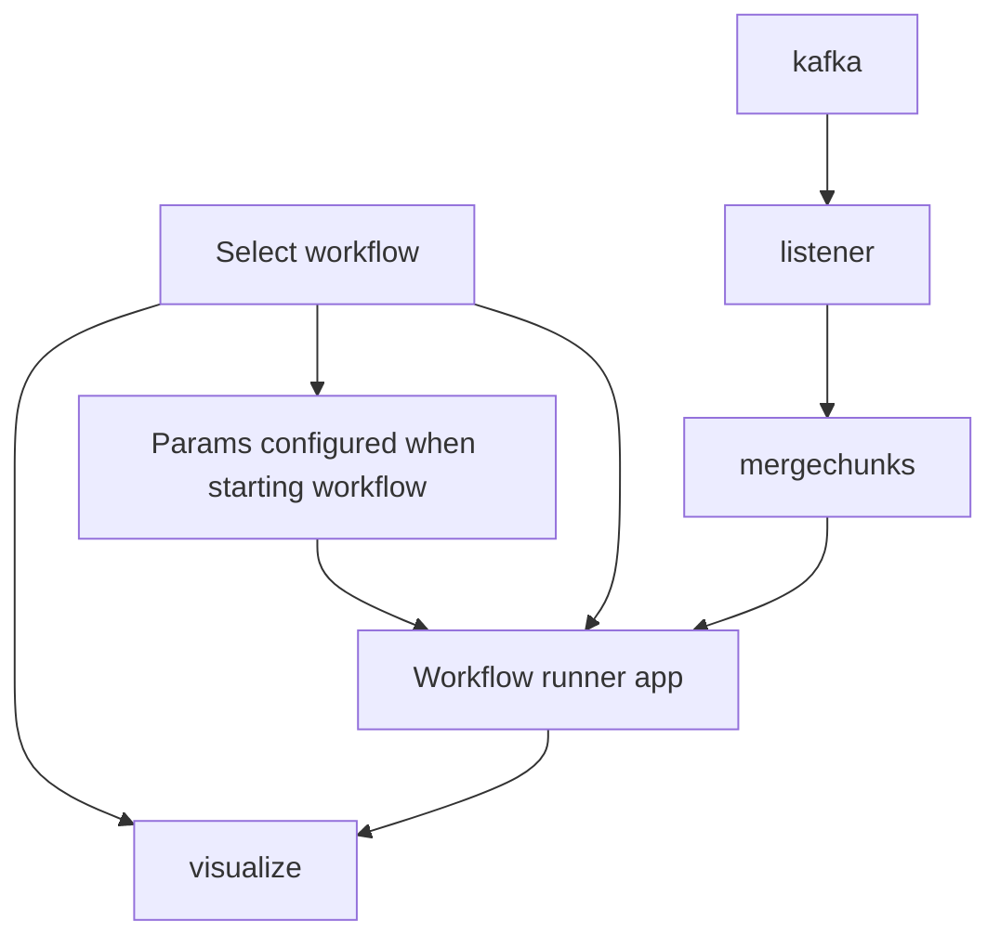

# Beamlime status and way forward

## General

- Where do we put the ScippNexus bits?
  Is the idea to use ScippNeutron for the parsing of each message?
  - The workflow should deal with this, invisible to Beamlime?
- How does cancellation work?
  Or stopping on user request?
  - Apps will check a flag?
- prototype_mini.py BasePrototype has too many workflow details?
- Workflow, DataReductionApp and related?
- DataReductionApp stop conditions?
- DataReductionApp self.workflow is a factory for the output type, how does this interact with input/output pipes?
  Or is it a factory for the function that can make the output from the input? does workflow.constant_provider add to factory?
  Line 228!
  Can all this be avoided by making the workflow a callable that takes a single input?
- What is the point of splitting the workflow into apps, based on function?
  The chunk merging should be quite static, workflow configurable with single input and output?
  SingletonProvider not needed?
- Concat and load instrument specific?
  Do we only need to concat events and logs, merge with run-start and hand off to workflow (which can use scippnexus)?
  That is, concat can be generic, "loader" part of workflow (black box)?
- tests/prototypes/parameters.py params/config embedded in code, what is the plan here?
- How should workflow handle things such as frame unwrapping, which may require longer-term info, but also history from previous chunks?
  - Do it internally, not exposed to Beamlime!?
- We must concat raw data, before changing event layout or anything!
  We want to feed concat result to ScippNexus.
- Do we need a way to avoid timing out when there are no events for a long time, e.g., when beam is down, but there is no need to restart dashboard.
  - Might be either no chunk or empty chunks, e.g., when beam is down.
  - Set long timeout? Test this!
  - Should all apps have a timeout? Or should a central manager decide when to shutdown apps?
- #95 redundant if we do not handle workflow pieces via Beamline's DI framework?

###

```python
class Workflow:
    def __init__(self, run_start, params: dict[str, ParamValue]):
        self.pipeline = sciline.Pipeline()

    def get_params(self) -> dict[str, ParamSpec]:
        """Return parameters for the workflow that can be configured by a user."""
        return {'wavelength-binning': ParamSpec(float, 0.0, 10.0, description='Wavelength binning', default=0.1)}

    def __call__(self, merged_chunk) -> sc.DataGroup:
        """
        Return plottable data
        
        For now return merged data. If workflow wants merge, it has to do it itself.
        We can later extract this, since it is somewhat generic (or implement helpers
        in this base class). Options are:
        - Show average over last X seconds.
        - Show total since start.
        """ 
        self.pipeline[RawData[SampleRun]] = merged_chunk
        return self.pipeline.compute(IofQ[SampleRun])
```




### Notes

- App (dashboard) almost never changes, but workflow does.
- App similar for instruments, but workflow different.
- Chunk merging:
  - Generic, does not need deep NeXus or workflow knowledge.
  - Concat fields of `NXevent_data` and `NXlog`
- Generic workflow wrapped in a fixed data reduction app.

### Next steps

- Define very basic workflow interface (ABC or Protocol?), **no extra features** (pair/group).
- Move components from prototype to `src/beamlime`.
- Change chunk merging to run before NeXus parsing, on raw JSON/Numpy.
  Should not depend on ScippNexus.
- Add support for running dashboard with workflow at given path (implementing `Workflow`).

### Things to test

- Behavior when no events for a long time.
- Cancellation, how do we kill or restart the dashboard?

## Kafka

- tests/prototypes/prototype_kafka.py: only single partition supported, do we need to change that? What is the plan?
- run-start message pl72. See scippneutron.data_steaming._consumer.py
- Is the plan to copy concrete Kafka bits from scippneutron into Beamlime?